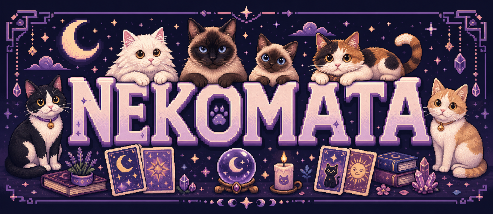
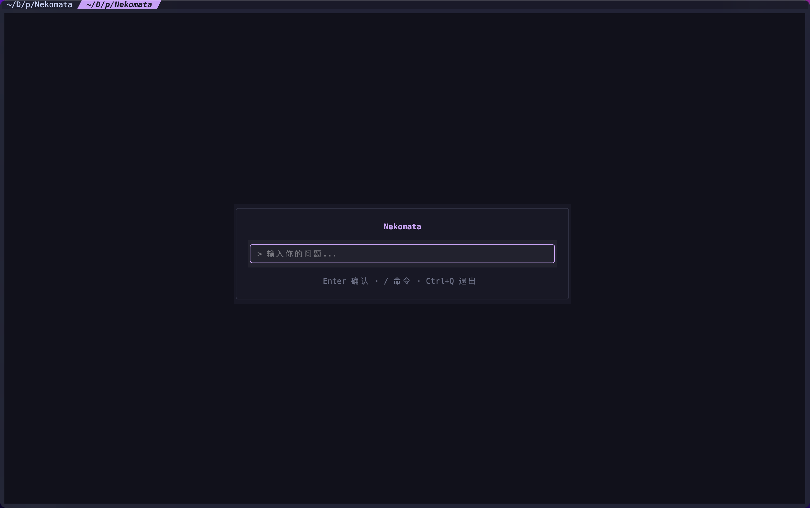

<p align="center">
  
</p>

<h1 align="center">塔罗猫 · Nekomata</h1>

<p align="center">
  <strong>住在终端里的像素风猫咪塔罗占卜应用</strong>
</p>

<p align="center">
  <a href="README_EN.md"></a>
  <a href="LICENSE"></a>
  <a href="LICENSE-ASSETS.md"></a>
  
  
</p>

> 中文名 **塔罗猫**。Nekomata 取自日语"猫又"：传说中的二尾妖猫，擅长变化与预知。

塔罗猫把 78 张塔罗牌全部画成猫咪主题像素牌面，并用 AI 做个性化解牌。它可以是一只住在终端里的占卜猫，也可以切换成 CLI、Web UI 或桌面窗口。

<p align="center">
  
</p>

## 功能一览

| 模块 | 说明 |
| --- | --- |
| **完整猫咪塔罗** | 22 张大阿尔卡纳 + 56 张小阿尔卡纳，全部融入猫咪元素，牌面支持自适应渲染 |
| **5 种牌阵** | 单牌 / 过去-现在-未来 / 现状-行动-结果 / 身-心-灵 / 五牌十字 |
| **AI 解牌** | OpenAI 兼容接口，流式输出，支持追问；客户端基于 urllib，无第三方 AI SDK |
| **四种运行模式** | TUI / CLI / Web UI / Desktop，按场景选择入口 |
| **双语界面** | 中文 / English，自研 i18n 从 `data/locales/` 懒加载 |

## 快速开始

Python 3.13+，推荐使用 [uv](https://docs.astral.sh/uv/)：

```bash
git clone https://github.com/ce1an69/Nekomata.git
cd Nekomata
uv sync
```

或直接安装：

```bash
pip install nekomata
```

可选依赖：

| 依赖 | 用途 |
| --- | --- |
| `--extra web` | Web UI |
| `--extra desktop` | 桌面窗口，包含 Web 依赖 |
| `--extra dev` | 测试、类型检查等开发工具 |

## 运行方式

```bash
nekomata
nekomata -c
nekomata -c -q "今天运势如何？" -S past_present_future -y
nekomata --web
nekomata-desktop
```

| 命令 | 模式 | 说明 |
| --- | --- | --- |
| `nekomata` | TUI | 默认模式，完整终端界面 |
| `nekomata -c` | CLI | 纯命令行交互 |
| `nekomata -c -q ... -S ... -y` | CLI | 单行占卜，可用于脚本 |
| `nekomata --web` | Web UI | FastAPI + vanilla JS，默认端口 8080 |
| `nekomata-desktop` | Desktop | PyWebView 原生桌面窗口 |

## 命令行参数

| 参数 | 说明 |
| --- | --- |
| `--web` | 启动 Web UI |
| `--port PORT` | Web 端口，默认 8080 |
| `--cli` / `-c` | CLI 模式 |
| `-q` / `--question` | 占卜问题 |
| `-s` / `--seed` | 随机种子，便于复现 |
| `-S` / `--spread` | 牌阵 key |
| `-y` / `--yes` | 跳过确认 |

## TUI 体验

TUI 模式使用 Kitty Graphics Protocol / Sixel 渲染像素风牌面，并会根据终端尺寸降级为 `full` / `medium` / `compact` / `preview` / `text`。

| 体验等级 | 终端 | 说明 |
| --- | --- | --- |
| **最佳** | Kitty · Ghostty · Contour | 原生 TGP 支持，牌面最清晰 |
| **良好** | WezTerm · Konsole · foot | Sixel 自动检测，牌面可显示 |
| **纯文本** | Alacritty、iTerm2 等其他终端 | 自动降级为文字/色块牌面 |

推荐终端窗口至少 **160×50** 以获得完整布局；低于 **80×24** 时会进入纯文本体验。

常用快捷键：

`q`/`Esc` 返回 · `↑↓←→` 导航 · `Enter` 确认 · `Tab` 切换面板 · `1`-`6` 选牌阵 · `i` 解读 · `d` 详情 · `r` 正逆位

## 配置

首次启动会进入引导界面，用来配置 AI 后端：

| 配置 | 说明 |
| --- | --- |
| API URL | OpenAI 兼容接口地址 |
| API Key | 模型服务密钥 |
| Model | 使用的模型名称 |
| Language | 中文 / English |

配置默认保存在 `.neko/settings.json`，也可通过环境变量覆盖：

```bash
NEKOMATA_API_URL=...
NEKOMATA_API_KEY=...
NEKOMATA_MODEL=...
```

## 技术栈

Python 3.13+ · Textual · textual-image · Pillow · FastAPI + vanilla JS · PyWebView · urllib · 自研 i18n

## 项目结构

```text
src/nekomata/        主代码：app / cli / desktop / card / spread / render / ai / screens / web
assets/              牌面、字体、图标、README 品牌图与截图
data/                牌义 YAML、i18n JSON、prompt 模板
tests/               pytest 单元 + 集成测试
scripts/             构建脚本
```

## 开发

```bash
uv sync --extra desktop --extra dev
uv run pytest
uv run pytest --cov=nekomata
```

测试使用 pytest + pytest-asyncio。TUI 测试通过 `app.run_test()`，AI 相关测试使用 mock。

## 许可证

| 范围 | 协议 |
| --- | --- |
| 代码 | [MIT License](LICENSE) |
| 美术资源 `assets/cards/` | [CC BY-NC-SA 4.0](LICENSE-ASSETS.md) |

## 致谢

[Textual](https://textual.textualize.io/) · [textual-image](https://github.com/sarusso/textual-image) · [FastAPI](https://fastapi.tiangolo.com/) · [Catppuccin](https://github.com/catppuccin/catppuccin) · [PyWebView](https://pywebview.flowrl.com/)
