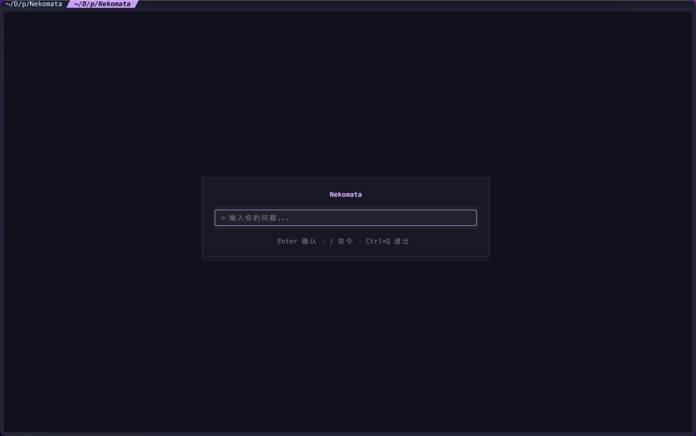

# Nekomata

<p align="center">
  
</p>

<p align="center">
  <strong>English</strong> | <a href="README_ZH.md">中文</a>
</p>

<p align="center">
  <a href="https://pypi.org/project/nekomata-tarot/"></a>
  <a href="https://github.com/ce1an69/Nekomata/actions/workflows/ci.yml"></a>
  <a href="LICENSE"></a>
  <a href="LICENSE-ASSETS.md"></a>
  
  
</p>

> "Nekomata" comes from the Japanese mythological two-tailed cat spirit, known for shapeshifting and foresight.

A pixel-art cat tarot divination app in your terminal. All 78 cards feature cat-themed artwork, with AI-powered personalized interpretations.

Supports three modes: **TUI** (default) / **CLI** / **Desktop**.

## Features

- **Full 78-card deck** — 22 Major + 56 Minor Arcana, pixel-art cards, adaptive rendering
- **5 spreads** — Single / Past-Present-Future / Situation-Action-Result / Body-Mind-Spirit / Five-Card Cross
- **AI interpretation** — OpenAI-compatible API, streaming output, follow-up questions, urllib-based (no SDK)
- **Multi-mode UI** — TUI (Catppuccin Mocha) / CLI / Desktop (PyWebView)
- **i18n** — Chinese / English

## Installation

```bash
pip install nekomata-tarot
```

Or install from source with [uv](https://docs.astral.sh/uv/):

```bash
git clone https://github.com/ce1an69/Nekomata.git
cd Nekomata
uv sync
```

Optional deps: `--extra desktop` (native desktop window) / `--extra dev` (testing, type checking).

See [Installation Guide](docs/en/INSTALLATION.md) for details.

## Usage

```bash
nekomata-tarot                  # TUI mode (default)
nekomata-tarot -c               # CLI interactive
nekomata-tarot -c -q "How's my luck?" -S past_present_future -y  # one-liner
nekomata-tarot --desktop        # native desktop window
```

### CLI Arguments

| Argument            | Description                |
| ------------------- | -------------------------- |
| `--cli` / `-c`      | CLI mode                   |
| `--desktop`         | Launch Desktop mode        |
| `-q` / `--question` | Question for reading       |
| `-s` / `--seed`     | Random seed (reproducible) |
| `-S` / `--spread`   | Spread key                 |
| `-y` / `--yes`      | Skip confirmation          |

### TUI Terminal Compatibility

TUI mode uses Kitty Graphics Protocol / Sixel for pixel-art card rendering. Experience varies by terminal:

| Experience   | Terminals                                | Notes                                       |
| ------------ | ---------------------------------------- | ------------------------------------------- |
| ✅ Best      | **Kitty** · **Ghostty** · **Contour**    | Native TGP support, sharpest card rendering |
| 👍 Good      | **WezTerm** · **Konsole** · **foot**     | Sixel auto-detected, cards display fine     |
| 📝 Text-only | Other terminals (e.g. Alacritty, iTerm2) | Falls back to text/colored-block cards      |

> 💡 Terminal window of at least **160×50** recommended for full layout. Below **80×24**, text-only mode kicks in.

### TUI Shortcuts

`q`/`Esc` back · `↑↓←→` navigate · `Enter` confirm · `Tab` switch panel · `1`-`6` select spread · `i` interpret · `d` details · `r` toggle reversed

## Configuration

First launch opens a setup wizard for the AI backend (API URL / key / model / language).

Settings saved in `.neko/settings.json`. Override via env vars: `NEKOMATA_API_URL` / `NEKOMATA_API_KEY` / `NEKOMATA_MODEL`.

## Tech Stack

Python 3.13+ · Textual · textual-image · Pillow · FastAPI + vanilla JS · PyWebView · urllib (AI) · custom i18n

## Project Structure

```
src/nekomata/
├── app.py         Entry point dispatcher
├── desktop.py     Desktop mode (PyWebView)
├── core/          Shared core (card, spread, ai, storage, i18n, render)
├── cli/           CLI mode
├── tui/           TUI mode (app, screens, animations)
├── web/           Web server (used by Desktop mode)
├── data/          Card meanings YAML, i18n JSON, prompt templates
└── assets/        Runtime assets (card images, fonts, icons)
gallery/           Non-runtime assets (origin PNGs, screenshots, brand images)
tests/             pytest unit + integration tests
scripts/           Build scripts
```

## Development

```bash
uv sync --extra desktop --extra dev
uv run pytest                  # all tests
uv run pytest --cov=nekomata   # coverage
```

## Documentation

| Document             | English                         | 中文                            |
| -------------------- | ------------------------------- | ------------------------------- |
| Installation Guide   | [EN](docs/en/INSTALLATION.md)   | [ZH](docs/zh/INSTALLATION.md)   |
| Building Desktop App | [EN](docs/en/PACKAGE.md)        | [ZH](docs/zh/PACKAGE.md)        |
| Changelog            | [EN](docs/en/CHANGELOG.md)      | [ZH](docs/zh/CHANGELOG.md)      |
| Contributing         | [EN](docs/en/CONTRIBUTING.md)   | [ZH](docs/zh/CONTRIBUTING.md)   |
| Security Policy      | [EN](docs/en/SECURITY.md)       | [ZH](docs/zh/SECURITY.md)       |

## License

- **Code**: [MIT License](LICENSE)
- **Art assets** (`assets/cards/`): [CC BY-NC-SA 4.0](LICENSE-ASSETS.md)

## Acknowledgments

[Textual](https://textual.textualize.io/) · [textual-image](https://github.com/sarusso/textual-image) · [FastAPI](https://fastapi.tiangolo.com/) · [Catppuccin](https://github.com/catppuccin/catppuccin) · [PyWebView](https://pywebview.flowrl.com/) · [Maple Mono](https://github.com/subframe7536/maple-font)
