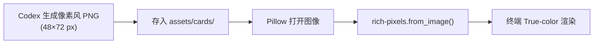
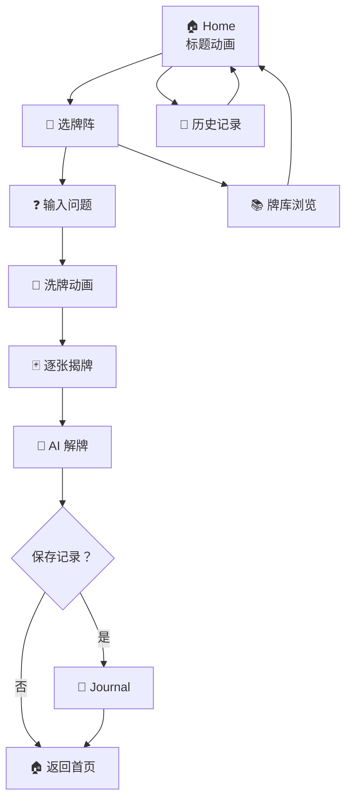
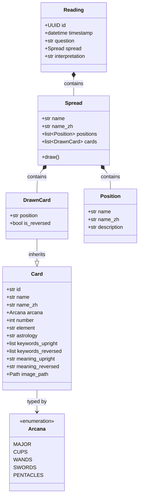
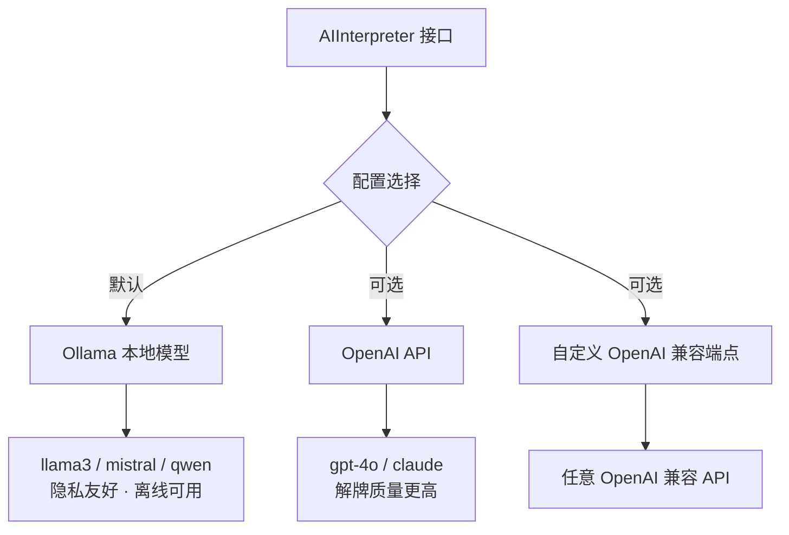
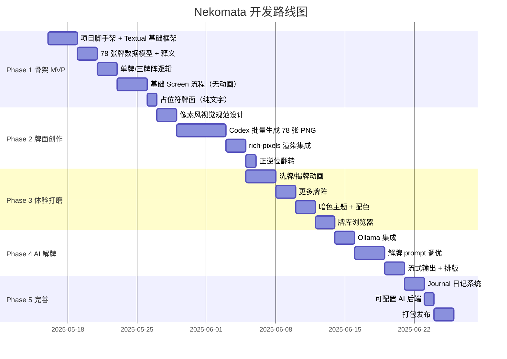

# Nekomata 🐱🌙 — 架构设计文档

> 像素风猫咪塔罗牌终端占卜，AI 解牌

## 一、项目概览

**项目名**：Nekomata（猫又）

**定位**：终端里的像素风猫咪塔罗占卜应用，78 张牌全部融入猫咪元素，搭配 AI 个性化解牌。

**技术栈**：

| 组件 | 技术选型 | 说明 |
|------|---------|------|
| 语言 | Python 3.12+ | 生态丰富，AI 集成方便 |
| TUI 框架 | Textual | Rich 生态，35.9k⭐，天然支持复杂布局 |
| 牌面渲染 | rich-pixels | half-block Unicode 渲染彩色像素图，和 Textual 一家 |
| 图像处理 | Pillow | 牌面缩放、翻转、调色板处理 |
| AI 解牌 | Ollama / OpenAI API | 本地优先，可配置后端 |
| 数据存储 | SQLite + JSON | 牌义数据 + 历史记录 |
| 牌面创作 | Codex | AI 生成像素风猫咪塔罗牌 PNG |
| 程序开发 | Claude Code | 主开发 agent |

**开源协议**：

- 代码：MIT
- 美术资源（牌面像素图）：CC BY-NC-SA 4.0

---

## 二、核心架构

四层架构，职责清晰分离：

```mermaid
graph TB
    subgraph "Presentation Layer"
        A[Home Screen]
        B[Spread Select]
        C[Question Input]
        D[Reading Screen]
        E[Interpretation]
        F[Card Browser]
        G[Journal]
    end

    subgraph "Rendering Layer"
        R1[rich-pixels 渲染]
        R2[ANSI True-color]
        R3[动画引擎]
    end

    subgraph "Game Logic Layer"
        L1[Deck 牌组]
        L2[Shuffle 洗牌]
        L3[Spread 牌阵]
        L4[Draw 抽牌]
        L5[Reversal 逆位]
    end

    subgraph "Service Layer"
        S1[Card Data 牌义]
        S2[AI Interpreter 解牌]
        S3[Journal Store 存储]
    end

    Presentation --> Rendering
    Presentation --> Game Logic
    Rendering --> Service
    Game Logic --> Service
```

---

## 三、牌面渲染方案

### 渲染流程



### 方案选型理由

| 方案 | 优点 | 缺点 | 结论 |
|------|------|------|------|
| ASCII art | 兼容性极好 | 无法表达像素风色彩 | ❌ 不选 |
| chafa / Sixel | 渲染质量高 | 依赖特定终端（kitty/iTerm2） | ❌ 兼容性差 |
| rich-pixels | True-color 兼容、和 Textual 天然集成 | 牺牲一点精度 | ✅ 最优解 |

### 牌面规格

- **分辨率**：48×72 像素（终端约 48 列 × 36 行，half-block 纵向翻倍）
- **色彩**：RGBA，像素风调色板限制（可选 32 色 / 64 色增强复古感）
- **逆位处理**：程序旋转 180° 翻转，无需生成额外 PNG
- **总量**：78 张 PNG（22 大阿卡纳 + 56 小阿卡纳）

---

## 四、用户流程



---

## 五、模块设计

### 目录结构

```
Nekomata/
├── pyproject.toml
├── README.md
├── LICENSE
├── docs/
│   └── architecture.md          # 本文档
├── assets/
│   ├── cards/
│   │   ├── major/               # 22 张大阿卡纳 PNG
│   │   ├── cups/                # 14 张圣杯
│   │   ├── wands/               # 14 张权杖
│   │   ├── swords/              # 14 张宝剑
│   │   └── pentacles/           # 14 张星币
│   └── ui/                      # 背景、边框、装饰像素图
├── data/
│   └── card_meanings.yaml       # 78 张牌的正逆位释义
├── src/
│   └── nekomata/
│       ├── __init__.py
│       ├── app.py               # Textual App 入口
│       ├── screens/
│       │   ├── home.py          # 首页（标题动画）
│       │   ├── spread_select.py # 选牌阵
│       │   ├── question.py      # 输入问题
│       │   ├── reading.py       # 洗牌 → 揭牌 → 展示
│       │   ├── interpretation.py# AI 解牌展示
│       │   ├── card_browser.py  # 牌库浏览
│       │   └── journal.py       # 历史记录
│       ├── card/
│       │   ├── deck.py          # 牌组逻辑（78张）
│       │   ├── types.py         # 数据模型
│       │   └── data.py          # 牌义数据加载
│       ├── spread/
│       │   ├── base.py          # 牌阵基类
│       │   ├── single.py        # 单牌
│       │   ├── three_card.py    # 三牌阵
│       │   ├── celtic.py        # 凯尔特十字
│       │   └── ...
│       ├── render/
│       │   ├── card_renderer.py # PNG → rich-pixels 渲染
│       │   ├── animations.py    # 洗牌/揭牌动画
│       │   └── themes.py        # 配色主题
│       ├── ai/
│       │   ├── interpreter.py   # AI 解牌接口
│       │   └── prompts.py       # 解牌 prompt 模板
│       └── storage/
│           └── journal.py       # SQLite 存储历史记录
└── tests/
```

### 核心数据模型



---

## 六、牌阵设计

| 牌阵 | 牌数 | 布局 | 用途 |
|------|------|------|------|
| 单牌 | 1 | `●` | 每日灵感 / 快速指引 |
| 三牌阵 | 3 | `● ● ●` | 过去 / 现在 / 未来 |
| 处境-行动-结果 | 3 | `● ● ●` | 问题分析型指引 |
| 身-心-灵 | 3 | `● ● ●` | 整体状态 |
| 五牌十字 | 5 | `  ●  \n● ● ●\n  ●  ` | 处境 + 挑战 + 潜力 |
| 凯尔特十字 | 10 | 经典十字布局 | 深度全面解读 |

### 凯尔特十字布局

```
        ┌───┐
        │ 5 │
   ┌───┐┌───┐┌───┐
   │ 4 ││ 1 ││ 2 │
   └───┘└───┘└───┘
   ┌───┐┌───┐
   │ 8 ││ 6 │
   └───┘└───┘
   ┌───┐
   │10 │        ┌───┐┌───┐
   └───┘        │ 7 ││ 9 │
                └───┘└───┘
```

---

## 七、AI 解牌模块

### 接口设计

```python
class AIInterpreter(Protocol):
    async def interpret(
        question: str,        # 用户的问题
        spread: Spread,       # 抽到的牌阵
        style: str = "mystical"  # 解牌风格
    ) -> AsyncIterator[str]:    # 流式返回解读文本
```

### 后端支持



### Prompt 设计思路

- 以"经验丰富的塔罗占卜师"角色设定
- 结合求问者具体问题 + 牌面组合进行整体解读
- 牌义数据作为参考注入 prompt，但鼓励 LLM 做创造性关联
- 解牌风格可配置：神秘风 / 温暖风 / 直白风

---

## 八、动画设计

| 场景 | 效果 | 时长 | 技术实现 |
|------|------|------|---------|
| 标题屏 | ASCII art logo + 像素装饰逐像素显示 | 1-2s | Textual `on_mount` + 定时器 |
| 洗牌 | 牌面随机位移 + 重叠 | 2-3s | Textual `animate` API |
| 揭牌 | 牌背面 → 滑入 → 翻转正面 | 0.5s/张 | CSS transform 模拟 |
| 逆位 | 牌面倒置 + 角标 `↕` | 即时 | Pillow rotate + Rich 样式 |
| AI 解牌 | 逐字流式输出 | 持续 | async generator + Textual Markdown |

---

## 九、猫咪元素设计

每张牌面融入猫咪行为，完美对应原牌含义：

| 塔罗牌 | 原牌含义 | 猫咪演绎 |
|--------|---------|---------|
| 0 愚者 | 无知无畏地前行 | 猫追蝴蝶，不管脚下悬崖 |
| I 魔术师 | 创造力、掌控工具 | 猫把桌上东西一件件推下去 |
| VIII 力量 | 内在力量、驯服 | 猫安静地盯着你，你不敢动 |
| XIII 死神 | 结束与重生 | 猫把花瓶从桌上推下去 |
| XVI 塔 | 突变、崩塌 | 猫把整个书架推倒 |
| XVII 星星 | 希望、灵感 | 猫在阳光下打盹，肚皮朝天 |
| XVIII 月亮 | 幻觉、潜意识 | 猫对着月亮嚎叫 |
| XXI 世界 | 圆满、完成 | 猫终于钻进了纸箱 |

---

## 十、开发计划



---

## 十一、潜在风险与应对

| 风险 | 说明 | 应对策略 |
|------|------|---------|
| 牌面版权 | Rider-Waite 在 EU 未公版 | AI 生成原创像素风猫咪牌面，不临摹任何现有牌组 |
| 终端兼容性 | rich-pixels 依赖 true-color 支持 | 启动时检测终端能力，降级方案用 ASCII art + ANSI 256 色 |
| 牌面风格统一性 | 78 张 AI 生成图风格可能不一致 | 先定视觉规范（调色板 + 模板），批量生成后人工审核调整 |
| 动画性能 | 复杂动画在低配终端可能卡顿 | 动画可配置关闭，保持核心功能流畅 |
| AI 解牌延迟 | Ollama 本地推理速度取决于硬件 | 流式输出 + 加载动画，优化体感 |
| 逆位辨识度 | 程序翻转后部分牌面不易区分正逆 | 角标标记 `↕` + 边框颜色区分（正位金色 / 逆位银色） |
