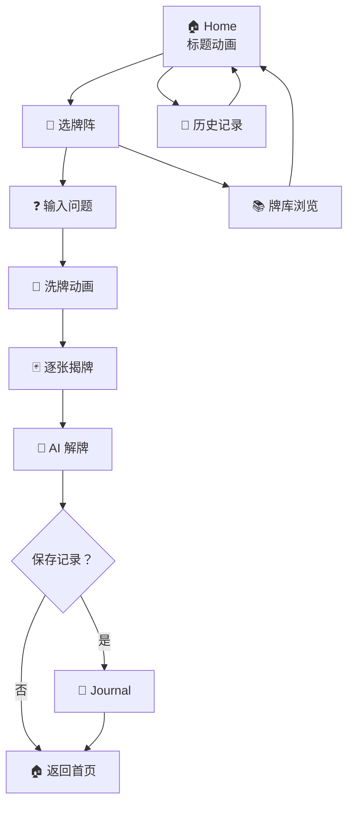
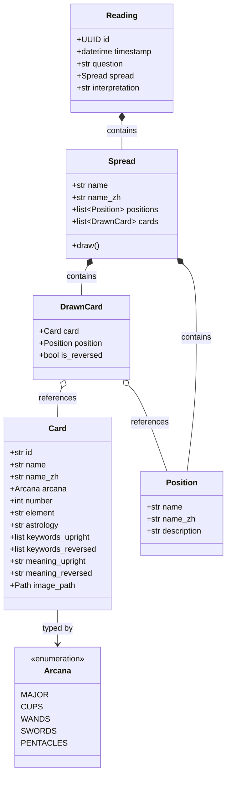
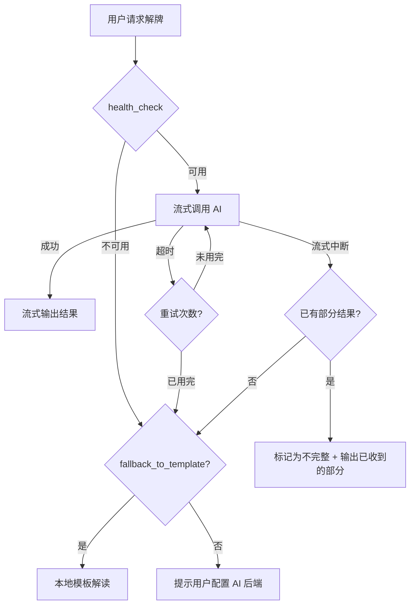
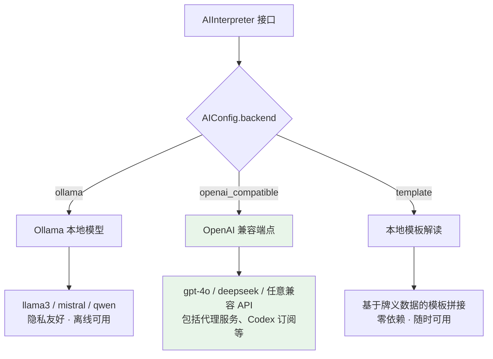
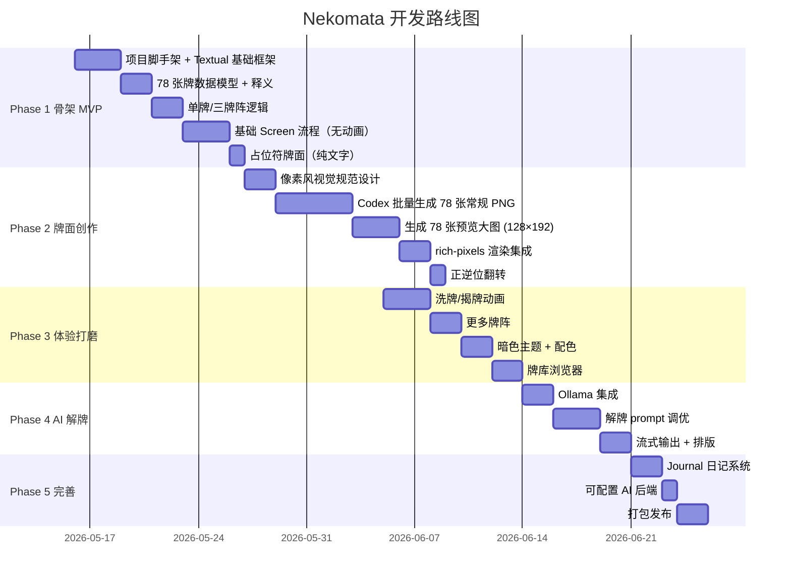

# Nekomata 🐱🌙 — 架构设计文档

> 像素风猫咪塔罗牌终端占卜，AI 解牌

## 一、项目概览

**项目名**：Nekomata（猫又）

**定位**：终端里的像素风猫咪塔罗占卜应用，78 张牌全部融入猫咪元素，搭配 AI 个性化解牌。

**技术栈**：

| 组件 | 技术选型 | 说明 |
|------|---------|------|
| 语言 | Python 3.12+ | 生态丰富，AI 集成方便 |
| TUI 框架 | Textual | Rich 生态，35.9k⭐，天然支持复杂布局 |
| 牌面渲染 | rich-pixels | half-block Unicode 渲染彩色像素图，和 Textual 一家 |
| 图像处理 | Pillow | 牌面缩放、翻转、调色板处理 |
| AI 解牌 | Ollama / OpenAI API | 本地优先，可配置后端 |
| 牌义数据 | YAML | 78 张牌的正逆位释义，人工可编辑 |
| 历史记录 | SQLite | 占卜日志、Journal 存储 |
| 用户配置 | TOML | AI 后端、解牌风格、动画偏好等配置 |
| 牌面创作 | Codex | AI 生成像素风猫咪塔罗牌 PNG |
| 程序开发 | Claude Code | 主开发 agent |

**开源协议**：

- 代码：MIT
- 美术资源（牌面像素图）：CC BY-NC-SA 4.0
  - 受 NC-SA 约束的文件范围：`assets/cards/`、`assets/ui/` 下所有 PNG 及衍生文件
  - 用户可替换自定义牌面资源，自定义资源不受本项目许可证约束
  - 打包发布时 `assets/` 目录需附带 LICENSE-ASSETS.md 说明素材许可证

---

## 二、核心架构

四层架构，职责清晰分离：

```mermaid
graph TB
    subgraph "Presentation Layer"
        A[Home Screen]
        B[Spread Select]
        C[Question Input]
        D[Reading Screen]
        E[Interpretation]
        F[Card Browser]
        G[Journal]
    end

    subgraph "Rendering Layer"
        R1[rich-pixels 渲染]
        R2[ANSI True-color]
        R3[动画引擎]
    end

    subgraph "Game Logic Layer"
        L1[Deck 牌组]
        L2[Shuffle 洗牌]
        L3[Spread 牌阵]
        L4[Draw 抽牌]
        L5[Reversal 逆位]
    end

    subgraph "Service Layer"
        S1[Card Data 牌义]
        S2[AI Interpreter 解牌]
        S3[Journal Store 存储]
    end

    Presentation --> Rendering
    Presentation --> Game Logic
    Presentation --> Service
    Game Logic --> Service
```

---

## 三、牌面渲染方案

### 渲染流程


### 方案选型理由

| 方案 | 优点 | 缺点 | 结论 |
|------|------|------|------|
| ASCII art | 兼容性极好 | 无法表达像素风色彩 | ❌ 不选 |
| chafa / Sixel | 渲染质量高 | 依赖特定终端（kitty/iTerm2） | ❌ 兼容性差 |
| rich-pixels | True-color 兼容、和 Textual 天然集成 | 牺牲一点精度 | ✅ 最优解 |

### 牌面规格

- **双尺寸资源**：每张牌两个 PNG，通过 card ID 命名约定区分

  | 用途 | 文件名 | 分辨率 | 终端占用 | 场景 |
  |------|--------|--------|---------|------|
  | 常规 | `{id}.png` | 64×96 | ~64×48 | 牌阵中多牌并排 |
  | 预览 | `{id}_detail.png` | 128×192 | ~128×96 | 选中卡牌放大查看 |

  预览路径由 `card.image_path` 推导：`path.with_name(stem + "_detail.png")`，无需修改数据模型。

- **色彩**：RGBA，像素风调色板限制（可选 32 色 / 64 色增强复古感）
- **逆位处理**：程序旋转 180° 翻转，无需生成额外 PNG
- **总量**：156 张 PNG（78 常规 + 78 预览）
- **缩放策略**：多牌阵时用 Pillow `NEAREST` 插值实时缩放，保持像素风格
  - 单牌展示：64×96（64 列 × 48 行）
  - 三牌阵：32×48（32 列 × 24 行，三张合计 96 列）
  - 凯尔特十字：32×48 或自定义尺寸，灵活排布
  - 卡牌预览：128×192（选中后右侧面板展示，需要 ≥128 列终端）

### 响应式布局策略

按终端尺寸动态选择渲染模式，启动时检测并监听 resize 事件：

| 终端尺寸（列×行） | 渲染模式 | 牌面尺寸 | 说明 |
|------------------|---------|---------|------|
| ≥160×50 | 全尺寸像素 | 64×96 | 完整体验 |
| ≥120×40 | 中等像素 | 48×72 | 标准体验 |
| ≥80×24 | 紧凑像素 | 32×48 | 最小像素模式 |
| <80×24 | 纯文字 | — | ASCII 符号 + 文字描述，无牌面图 |

- **最小支持终端**：80 列 × 24 行（纯文字模式）
- **推荐终端**：120 列 × 40 行及以上
- 检测逻辑：启动时通过 `shutil.get_terminal_size()` 获取尺寸，Textual `on_resize` 事件动态切换
- 降级提示：终端不满足像素模式时，首页显示建议"放大终端窗口以获得最佳体验"

---

## 四、用户流程



---

## 五、模块设计

### 目录结构

```
Nekomata/
├── pyproject.toml
├── README.md
├── LICENSE
├── docs/
│   └── architecture.md          # 本文档
├── assets/
│   ├── cards/
│   │   ├── major/               # 22 张大阿卡纳 PNG（每张 2 个尺寸）
│   │   │   ├── major_00.png         # 常规 64×96
│   │   │   ├── major_00_detail.png  # 预览 128×192
│   │   │   └── ...
│   │   ├── cups/                # 14 张圣杯（同上双尺寸）
│   │   ├── wands/               # 14 张权杖
│   │   ├── swords/              # 14 张宝剑
│   │   └── pentacles/           # 14 张星币
│   └── ui/                      # 背景、边框、装饰像素图
├── data/
│   └── card_meanings.yaml       # 78 张牌的正逆位释义（YAML）
├── src/
│   └── nekomata/
│       ├── __init__.py
│       ├── app.py               # Textual App 入口
│       ├── screens/
│       │   ├── home.py          # 首页（标题动画）
│       │   ├── spread_select.py # 选牌阵
│       │   ├── question.py      # 输入问题
│       │   ├── reading.py       # 洗牌 → 揭牌 → 展示
│       │   ├── interpretation.py# AI 解牌展示
│       │   ├── card_browser.py  # 牌库浏览
│       │   └── journal.py       # 历史记录
│       ├── card/
│       │   ├── deck.py          # 牌组逻辑（78张）
│       │   ├── types.py         # 数据模型
│       │   └── data.py          # 牌义数据加载
│       ├── spread/
│       │   ├── base.py          # 牌阵基类
│       │   ├── single.py        # 单牌
│       │   ├── three_card.py    # 三牌阵
│       │   ├── celtic.py        # 凯尔特十字
│       │   └── ...
│       ├── render/
│       │   ├── card_renderer.py # PNG → rich-pixels 渲染 + 卡牌预览
│       │   ├── animations.py    # 洗牌/揭牌动画
│       │   └── themes.py        # 配色主题
│       ├── ai/
│       │   ├── interpreter.py   # AI 解牌接口
│       │   └── prompts.py       # 解牌 prompt 模板
│       └── storage/
│           ├── journal.py       # SQLite 存储历史记录
│           └── config.py        # TOML 用户配置读写
├── config.toml                  # 用户配置（AI 后端、偏好等）
└── tests/
```

### 核心数据模型



---

## 六、牌阵设计

| 牌阵 | 牌数 | 布局 | 用途 |
|------|------|------|------|
| 单牌 | 1 | `●` | 每日灵感 / 快速指引 |
| 三牌阵 | 3 | `● ● ●` | 过去 / 现在 / 未来 |
| 处境-行动-结果 | 3 | `● ● ●` | 问题分析型指引 |
| 身-心-灵 | 3 | `● ● ●` | 整体状态 |
| 五牌十字 | 5 | `  ●  \n● ● ●\n  ●  ` | 处境 + 挑战 + 潜力 |
| 凯尔特十字 | 10 | 经典十字布局 | 深度全面解读 |

### 凯尔特十字布局

```
        ┌───┐
        │ 5 │
   ┌───┐┌───┐┌───┐
   │ 4 ││ 1 ││ 2 │
   └───┘└───┘└───┘
   ┌───┐┌───┐
   │ 8 ││ 6 │
   └───┘└───┘
   ┌───┐
   │10 │        ┌───┐┌───┐
   └───┘        │ 7 ││ 9 │
                └───┘└───┘
```

| 编号 | 牌位名 | 含义 |
|------|--------|------|
| 1 | 当前处境 | 问题的核心现状 |
| 2 | 挑战 | 面临的阻碍或冲突 |
| 3 | 潜意识 | 深层影响、未被察觉的因素 |
| 4 | 过去 | 近期影响当前局势的事件 |
| 5 | 可能结果 | 按当前趋势的自然发展 |
| 6 | 未来 | 即将发生的事件 |
| 7 | 自我 | 求问者的态度和心态 |
| 8 | 环境 | 外部影响（他人、社会、环境） |
| 9 | 指引 | 建议的行动方向 |
| 10 | 最终结果 | 整体局势的最终走向 |

---

## 七、AI 解牌模块

### 接口设计

```python
@dataclass
class AIConfig:
    backend: str = "ollama"              # ollama / openai_compatible / template
    model: str = "llama3"                # 模型名称
    base_url: str = "http://localhost:11434"  # API 端点
    api_key: str | None = None           # API key（本地后端可为 None）
    timeout: float = 60.0                # 单次请求超时（秒）
    style: str = "mystical"              # 解牌风格：mystical / warm / direct
    max_retries: int = 2                 # 失败重试次数
    fallback_to_template: bool = True    # AI 不可用时是否降级到模板解读

class InterpretationError(Exception):
    """AI 解牌异常基类"""
    retryable: bool                      # 是否可重试

class AIInterpreter(Protocol):
    async def interpret(
        self,
        question: str,
        spread: Spread,
        config: AIConfig | None = None,
        cancel_event: asyncio.Event | None = None,
    ) -> AsyncIterator[str]:             # 流式返回解读文本
        ...

    async def health_check(self) -> bool:
        """检查后端是否可用"""
        ...
```

### 错误处理与降级策略



### 后端支持（可扩展）



新增后端只需实现 `AIInterpreter` 协议并在 `AIConfig.backend` 中注册名称，无需改动调用方。

### Prompt 设计思路

- 以"经验丰富的塔罗占卜师"角色设定
- 结合求问者具体问题 + 牌面组合进行整体解读
- 牌义数据作为参考注入 prompt，但鼓励 LLM 做创造性关联
- 解牌风格可配置：神秘风 / 温暖风 / 直白风

---

## 八、动画设计

| 场景 | 效果 | 时长 | 技术实现 |
|------|------|------|---------|
| 标题屏 | ASCII art logo + 像素装饰逐像素显示 | 1-2s | Textual `on_mount` + `set_interval` 定时刷新 |
| 洗牌 | 牌面随机位移 + 重叠 | 2-3s | Textual `animate("offset", ...)` 平移动画 |
| 揭牌 | 牌背面 → 滑入 → 显示正面 | 0.5s/张 | `animate("offset")` 滑入 + `animate("opacity")` 淡入切换牌面 |
| 逆位 | 牌面倒置 + 角标 `↕` | 即时 | Pillow `rotate(180)` + Rich 样式（正位金边框 / 逆位银边框） |
| AI 解牌 | 逐字流式输出 | 持续 | async generator + Textual `Markdown` widget 增量更新 |

> **注**：Textual 动画支持 `offset`（位移）、`opacity`（透明度）、`styles` 属性动画，不支持浏览器式 3D 翻转。揭牌效果通过位移 + 透明度组合实现"翻牌"视觉。动画可通过配置关闭。

---

## 九、猫咪元素设计

每张牌面融入猫咪行为，完美对应原牌含义：

| 塔罗牌 | 原牌含义 | 猫咪演绎 |
|--------|---------|---------|
| 0 愚者 | 无知无畏地前行 | 猫追蝴蝶，不管脚下悬崖 |
| I 魔术师 | 创造力、掌控工具 | 猫把桌上东西一件件推下去 |
| VIII 力量 | 内在力量、驯服 | 猫安静地盯着你，你不敢动 |
| XIII 死神 | 结束与重生 | 猫把花瓶从桌上推下去 |
| XVI 塔 | 突变、崩塌 | 猫把整个书架推倒 |
| XVII 星星 | 希望、灵感 | 猫在阳光下打盹，肚皮朝天 |
| XVIII 月亮 | 幻觉、潜意识 | 猫对着月亮嚎叫 |
| XXI 世界 | 圆满、完成 | 猫终于钻进了纸箱 |

---

## 十、开发计划



---

## 十一、潜在风险与应对

| 风险 | 说明 | 应对策略 |
|------|------|---------|
| 牌面版权 | 现有商业牌组受版权保护，且 AI 生成图的训练数据/提示词可能间接临摹特定牌组 | 生成规范：不引用具体商业牌组名称和风格描述，提示词仅使用"像素风 + 猫咪 + 塔罗元素"等通用描述；生成后人工审核排除相似度过高的牌面 |
| 终端兼容性 | rich-pixels 依赖 true-color 支持 | 启动时检测终端能力，按响应式布局策略降级（见第三节） |
| 牌面风格统一性 | 156 张 AI 生成图（78 常规 + 78 预览）风格可能不一致 | 先定视觉规范（调色板 + 模板），预览版在常规版基础上放大重绘细节，批量生成后人工审核调整 |
| 动画性能 | 复杂动画在低配终端可能卡顿 | 动画可通过配置关闭，保持核心功能流畅 |
| AI 解牌延迟 | Ollama 本地推理速度取决于硬件 | 流式输出 + 加载动画 + 模板降级，优化体感 |
| 逆位辨识度 | 程序翻转后部分牌面不易区分正逆 | 角标标记 `↕` + 边框颜色区分（正位金色 / 逆位银色） |

---

## 十二、测试策略

### 单元测试（`tests/unit/`）

| 模块 | 测试要点 |
|------|---------|
| `card/deck.py` | 78 张牌完整性（编号 0-21 + 四花色各 14 张）、无重复 ID |
| `card/deck.py` | 洗牌结果无重复、所有牌均被抽到 |
| `card/deck.py` | 逆位概率约 50%（大样本统计检验） |
| `card/types.py` | Card / DrawnCard 数据模型验证 |
| `card/data.py` | YAML 牌义加载：78 张牌均有正逆位释义、字段完整 |
| `spread/*.py` | 各牌阵 positions 数量与 draw 数量一致 |
| `spread/base.py` | Spread.draw() 返回正确数量的 DrawnCard |
| `render/card_renderer.py` | 不同渲染模式选择逻辑（全尺寸/中等/紧凑/纯文字） |
| `render/card_renderer.py` | 逆位 Pillow rotate(180) 正确性 |
| `render/card_renderer.py` | 预览路径推导（`get_preview_path`） |
| `render/card_renderer.py` | 卡牌预览详情渲染（正逆位全部信息） |
| `ai/interpreter.py` | Mock AI 后端：流式输出、超时取消、降级到模板 |
| `storage/journal.py` | Reading 序列化/反序列化、SQLite CRUD |
| `storage/config.py` | TOML 配置读写、默认值回退 |

### 集成测试（`tests/integration/`）

| 场景 | 测试要点 |
|------|---------|
| 完整占卜流程 | 选牌阵 → 输入问题 → 洗牌 → 抽牌 → 展示结果 |
| AI 降级流程 | health_check 失败 → 降级到模板解读 → 正确输出 |
| 终端尺寸切换 | resize 事件触发渲染模式切换 |
| Journal 存储 | 完成一次占卜 → 保存 → 重新加载验证数据完整 |

### 测试工具

- **pytest** + **pytest-asyncio**：异步测试
- **Textual pilot**：Screen 流程的自动化交互测试（`app.run_test()`）
- **pytest-mock**：AI 后端 mock
